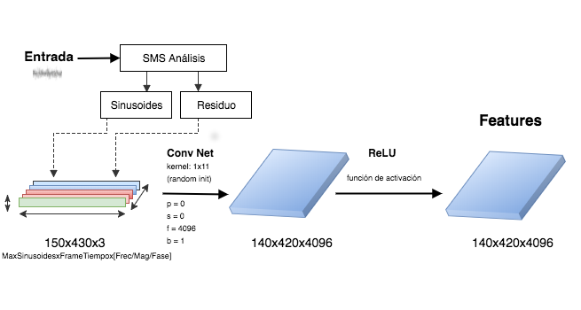

# Transferencia de estilo entre audios

Este trabajo tiene como objetivo aplicar en archivos de audio las técnicas de procesamiento con redes neuronales desarrolladas para la transferencia de estilo en imágenes. En particular, aquellas que son de reciente publicación y dentro de su arquitectura utilizan una o más capas de redes neuronales convolucionales (CNN). Para ello, se construyen representaciones de la señal audible en matrices de estructura similar a las que normalmente se utilizan para procesar imagenes. Se evaluan diferentes aproximaciones al problema utlizando técnicas de análisis/síntesis como la transformada de tiempo corto de Fourier (STFT) y la descomposición de la señal de entrada en sinusoides y residuo, derivada del Spectral Modelling Synthesis (SMS), históricamente utilizado en señales de voz. Aunque la definición de estilo puede ser subjetiva, se ensayan algunas aproximaciones en su definición y reconocimiento. Para esto, se desarrollan e implementan diferentes programas en Python utilizando el framework TensorFlow, pensado para construir y entrenar redes neuronales. El resultado es un enfoque diferente para la aplicación de efectos digitales en señales de audio. 

# Arquitectura CNN

# Dependencias
Ver [INSTALL.md](INSTALL.md) para configurar las dependencias.

# Usar

    $ git clone https://github.com/hordiales/transferencia-estilo-sms
    $ cd transferencia-estilo-cnn
    $ juypter notebook

# Referencias:

* A Neural Algorithm of Artistic Style (Gatys et al.): https://arxiv.org/abs/1508.06576
* Audio style transfer with STFT y TF: https://github.com/DmitryUlyanov/neural-style-audio-tf
* SMS (Spectral Modelling Synthesis): https://github.com/MTG/sms-tools
    * Sound analysis/synthesis tools for music applications written in python (with a bit of C) plus complementary lecture materials
* Other libraries: LibRosa, numpy, matplotlib

# Tips para samples y texturas

Ver scripts/

* Recortar samples con la misma duración
* Identificar BPM y adaptar si es necesario

# Optimizaciones

Ver [Optimizaciones.md](Optimizaciones.md).

# License

GPLv3, ver [LICENSE](LICENSE).
